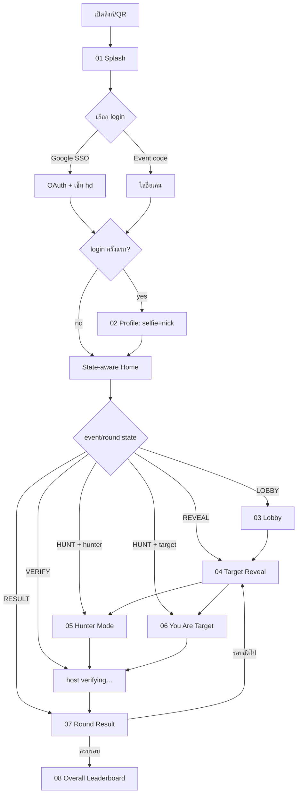

# FaceHunt v2 — Manhunt Mode · PRD (Next.js, self-hosted)

> เวอร์ชันนี้ทับ PRD เดิมทั้งหมด เปลี่ยนกติกาจาก "นับหน้า" (v1) เป็น **Manhunt** และ
> **ตัด face detection / embedding / dedup ออกทั้งก้อน** — การตัดสินว่ารูปใช่ target ไหม
> เป็นหน้าที่ของ **admin (human verify)** ทำให้ไม่ต้องมี AWS, InsightFace, pgvector, .NET, Python อีกต่อไป
>
> **Stack:** Next.js เดี่ยวๆ · **Deploy:** เครื่อง Mac เครื่องนี้ · **UI:** ตาม `index.html` (v2 design, 9 screens)

---

## 1. Overview

FaceHunt เป็นเกมปาร์ตี้บริษัท (50–100 คน) เล่นในงานกลางคืน เป็น **manhunt หลายรอบ**:
ระบบสุ่ม 1 คนเป็น **TARGET** → คนที่เหลือ (**hunters**) ต้องถ่ายรูปหน้า target ให้ได้ →
ส่งรูปเข้าคิว → **admin/host ตรวจเองว่าใช่ target ไหม** → 5 คนแรกที่ผ่านการ verify ได้แต้ม
**10 / 6 / 4 / 2 / 1** → target ที่ "รอด" ได้ **+5** → เล่นหลายรอบ สะสมแต้ม → ผู้ชนะรวม

**เป้าหมายหลัก**
- เล่นจริงได้ในงาน บนเครื่องนี้ รองรับ ~100 คนพร้อมกัน
- Host คุมเกมจากจอเดียว (start/verify/next) + ฉายขึ้น projector ได้
- ใช้งานง่ายบนมือถือ, vibe กลางคืน (ตาม design ที่มีแล้ว)
- ค่าใช้จ่าย ~0 บาท, ไม่มี external AI service

**Non-goals (P0):** ไม่มี face detection อัตโนมัติ, ไม่มี anti-spoofing, ไม่มี multi-event SaaS, ไม่มี native app

---

## 2. ❓ Decisions to confirm (ตอนนี้ใช้ default ที่ทำเครื่องหมาย — แก้ได้)

| # | เรื่อง | Default ที่จะใช้ | ทำไม |
|---|--------|------------------|------|
| D1 | จำนวนรอบ / เวลาต่อรอบ | **4 rounds × 60s** (admin ตั้งค่าได้) | ตรงกับ design |
| D2 | นิยาม "target รอด" → +5 | **รอบหมดเวลาโดยมี verified match = 0 → รอด (+5)**; ถ้าโดน verify ≥1 = ถูกจับ (+0) | ชัด, คุมง่าย |
| D3 | สุ่ม target ยังไง | **สุ่มจากคนที่ joined, ไม่ซ้ำคนเดิมจนครบทุกคนก่อน** แล้วค่อยวนใหม่ | ทุกคนได้เป็น target |
| D4 | 1 hunter ส่งได้กี่ครั้ง/รอบ | **ส่งได้หลายครั้ง แต่ได้แต้มสูงสุด 1 อันดับต่อรอบ** (นับ verified match แรก) | กันคนเดียวกินหลาย rank |
| D5 | Auth | **Google SSO (Auth.js) + จำกัด domain (optional)** และมีทางลัด **"ใส่ชื่อเล่น + รหัสงาน"** สำหรับแขก | ตาม design (มีปุ่ม Google + single-use code) |
| D6 | Database | **SQLite (better-sqlite3)** ไฟล์เดียว ไม่ต้อง Docker | เครื่องเดียว, simple สุด, พอสำหรับ 100 คน |
| D7 | Realtime | **SSE (Server-Sent Events)** broadcast state/leaderboard/ticker + polling fallback | client เป็นฝ่ายรับเป็นหลัก, ไม่ต้องตั้ง WS server |
| D8 | เก็บรูป / retention | local FS, **ลบอัตโนมัติหลังงาน +7 วัน** + consent banner | privacy |
| D9 | Public URL | **Cloudflare Tunnel → subdomain ของ `totoland.cloud`** | ฟรี, มี cert, OAuth happy |

**ยังต้องการจากพี่ (ไม่บล็อกการเขียน PRD แต่ต้องมีก่อน deploy จริง):**
- โดเมนบริษัทสำหรับ `hd=` (ถ้าจะจำกัด Google SSO) — หรือจะเปิดให้ Gmail ทั่วไป?
- Google OAuth `client_id` / `client_secret` (สร้างใน Google Cloud Console)
- วัน/เวลางานจริง (เพื่อจัดลำดับ P0)
- subdomain ที่อยากใช้ (เช่น `facehunt.totoland.cloud`)

---

## 3. Game Design

### 3.1 Roles
- **Player / Hunter** — ผู้เล่นทั่วไป; ทุกคนเป็น hunter ยกเว้นรอบที่ตัวเองถูกสุ่มเป็น target
- **Target** — ผู้เล่นที่ถูกสุ่มในรอบนั้น (1 คน/รอบ)
- **Admin / Host** — คุมเกม + verify รูป (P0: คนเดียว)

### 3.2 Round lifecycle (ต่อ 1 รอบ)
```
REVEAL (3s)  →  HUNT (60s)  →  VERIFY (admin เคลียร์คิว)  →  RESULT (เผยผล ~10s)  →  รอบถัดไป / จบเกม
```
- **REVEAL**: สุ่ม target, broadcast selfie+ชื่อ ไปทุกเครื่อง + projector (screen 04)
- **HUNT**: hunters ถ่าย+ส่งรูป; target พยายามรอด (screen 05 / 06); timer เดิน
- **VERIFY**: หมดเวลา (หรือครบ 5 verified ก่อน) → admin ตรวจคิว (screen 09): Match → assign rank #1..#5 + แต้ม 10/6/4/2/1 ตามลำดับ approve
- **RESULT**: podium + สถานะ target (รอด/ถูกจับ) (screen 07) → กด Next round

### 3.3 Scoring
| ใคร | เงื่อนไข | แต้ม |
|-----|---------|------|
| Hunter อันดับ 1–5 (verified) | ตามลำดับที่ admin approve | 10 / 6 / 4 / 2 / 1 |
| Target | รอบหมดเวลาโดยไม่มีใคร verified (D2) | +5 |
| Target | ถูก verify ≥1 | +0 |

- แต้มสะสมข้ามรอบ → **Overall leaderboard** (screen 08)
- ลำดับรวมเสมอกัน → tiebreak: รวม rank ดีกว่า (เช่น #1 บ่อยกว่า) — *(P1, P0 แค่เรียงตามแต้ม)*

---

## 4. Event / Round State Machine

```
Event:  DRAFT → LOBBY → RUNNING → FINISHED
Round:  PENDING → REVEAL → HUNT → VERIFY → RESULT → CLOSED
```
- Server timestamp = source of truth (กัน client ปลอมเวลา)
- รับ submission เฉพาะตอน round = HUNT; หลัง HUNT + grace 5s → reject (HTTP 423)
- Admin เป็นคน trigger transition (start round / end round / next) — broadcast ผ่าน SSE

### 4.1 End-to-end Flow (login → จบเกม)

**Player journey (จอเปลี่ยนเองตาม state ผ่าน SSE — ไม่ต้องกดสลับ):**
```
              [เปิดลิงก์ / สแกน QR]
                       │
                       ▼
               ┌──────────────┐
               │  01 Splash   │
               └──────┬───────┘
              ┌────────┴─────────┐
              ▼                  ▼
     [Sign in w/ Google]   [Use event code]
        │ (เช็ค hd domain)    │ (+ ใส่ชื่อเล่น)
        └─────────┬───────────┘
                  ▼
            login ครั้งแรก?
             ┌────┴────┐
            yes        no
             │          │
             ▼          │
      ┌──────────────┐  │
      │ 02 Profile   │  │  ← ถ่าย selfie + ตั้งชื่อเล่น (selfie ใช้ตอนเป็น target)
      │  selfie+nick │  │
      └──────┬───────┘  │
             └────┬─────┘
                  ▼
       ╔═══════════════════════════╗
       ║   STATE-AWARE HOME        ║  ← เช็ค event/round state แล้วพาไปจอที่ใช่
       ╚═══════════════════════════╝
                  │
        event state?
        ├─ LOBBY ──────────────────►  03 Lobby (รอ host เริ่ม, เห็น player count สด)
        │
        └─ RUNNING → วนต่อรอบ:
             REVEAL (3s) ──────────►  04 Target Reveal (โชว์ target ที่สุ่มได้)
                  │
             HUNT (60s) ─┬ เป็น target ─►  06 You Are The Target (survival timer)
                         └ เป็น hunter ─►  05 Hunter Mode (ถ่าย + ส่ง + ticker)
                  │
             VERIFY ───────────────►  (interstitial "host กำลัง verify…")
                  │
             RESULT ───────────────►  07 Round Result (podium + target รอด/โดนจับ)
                  │
                  └─► รอบถัดไป (กลับ REVEAL)  ──ครบรอบ──►  08 Overall Leaderboard (final)
```

**Admin / Host lane (ขับ state ทุกอย่าง):**
```
[Admin login — email อยู่ใน allowlist]  →  09 Admin Verify/Control
   create + config event              →  LOBBY (players ทยอย join)
   กด Start round                     →  REVEAL (สุ่ม target, broadcast) → HUNT (timer เดิน)
        ⟲ submissions ไหลเข้า queue แบบ realtime ระหว่าง HUNT
   กด End round (หมดเวลา / ครบ 5 verified) →  VERIFY: Match / Not / Skip
        └ Match → auto-assign rank #1..#5 + แต้ม 10/6/4/2/1 (cap 5)
   Reveal result → Next round  …  หลังรอบสุดท้าย → FINISHED
```

**พฤติกรรม/edge case สำคัญ:**
- Player **ไม่ต้องกดสลับจอ** — server push สั่งเปลี่ยนจอเองตาม round state
- **Late joiner**: login ตอน HUNT → เด้งเข้า Hunter Mode ทันที (เวลาที่เหลือ = penalty ธรรมชาติ)
- **Target ไม่มี selfie**: ถ้า skip ตอน profile แล้วถูกสุ่มเป็น target → reveal ใช้ avatar ตัวย่อแทน (แนะนำให้ถ่าย)
- **Submit ถูก gate**: ส่งได้เฉพาะตอน HUNT + ปุ่ม capture disabled ถ้ากล้องไม่เจอหน้า (ตาม design); หลังหมดเวลา +grace 5s → reject



---

## 5. Screens (ใช้ design `index.html` เดิม — 9 จอ)

| # | Screen | แสดงเมื่อ (state) | ของจริงที่ต้องต่อ |
|---|--------|-------------------|-------------------|
| 1 | Splash / Login | ไม่ login | Google SSO / code |
| 2 | Profile Setup | login ครั้งแรก | selfie (กล้อง) + nickname → save |
| 3 | Lobby | LOBBY | live player count (SSE), waiting |
| 4 | Target Reveal | REVEAL | target ที่สุ่มได้ (SSE push) |
| 5 | Hunter Mode | HUNT (ไม่ใช่ target) | กล้อง, timer, ส่งรูป, ticker (SSE) |
| 6 | You Are The Target | HUNT (เป็น target) | survival timer, จำนวน hunter/submission (SSE) |
| 7 | Round Result | RESULT | podium จริงจาก verify |
| 8 | Overall Leaderboard | ทุกเวลา | แต้มสะสม (SSE) |
| 9 | Admin Verify Queue | admin only | คิว submission จริง + Match/Not/Skip → scoring |

**Player UI = state-aware**: จอที่เห็นเปลี่ยนตาม event/round state อัตโนมัติ (ไม่ต้องกดเอง)

---

## 6. Tech Stack & Architecture (Next.js only)

```
                 Cloudflare Tunnel (facehunt.totoland.cloud)
                              │  HTTPS
                              ▼
   ┌─────────────────────────────────────────────────────┐
   │  Next.js 15 (App Router, TypeScript) — process เดียว │
   │   • UI (React + Tailwind, จาก index.html)            │
   │   • Route Handlers = API (/api/*)                    │
   │   • SSE endpoint (/api/stream) broadcast state       │
   │   • Auth.js (Google OAuth)                           │
   │   • better-sqlite3  → ./data/facehunt.db             │
   │   • Photos → ./data/photos/{event}/{round}/{id}.jpg  │
   └─────────────────────────────────────────────────────┘
                  รันบน Mac เครื่องนี้ (node / pm2 + caffeinate)
```

- **Framework**: Next.js 15 App Router + React 19 + Tailwind + TypeScript
- **State/realtime**: in-memory event bus + SSE (1 process จึง broadcast ง่าย); DB เป็น source of truth
- **DB**: SQLite (`better-sqlite3`) — WAL mode
- **Auth**: Auth.js (NextAuth v5) Google provider; role `admin` จาก allowlist email
- **ไม่มี**: Docker (optional), Python, .NET, Redis, Postgres, AWS — *(P0)*

---

## 7. Data Model (SQLite)

```sql
users(        id, email, name, nickname, selfie_path, hue, role, created_at)
events(       id, name, status, current_round_id, rounds_planned, round_seconds, created_at)
rounds(       id, event_id, idx, status, target_user_id, started_at, hunt_ends_at, closed_at)
submissions(  id, round_id, hunter_id, photo_path, status,        -- pending|approved|rejected|skipped
              rank, points, server_received_at, verified_at, verified_by)
scores(       id, event_id, user_id, round_id, points, reason)    -- reason: hunt_rank | target_survive
```
- คะแนนรวม = `SELECT user_id, SUM(points) FROM scores WHERE event_id=? GROUP BY user_id ORDER BY SUM DESC`
- "first 5 verified" = `submissions` ที่ status=approved เรียงตาม `verified_at`, rank 1..5
- กัน 1 hunter หลาย rank (D4): approve แล้วถ้า hunter นี้มี approved ในรอบนี้อยู่แล้ว → ไม่ให้ rank ใหม่

---

## 8. API Surface (Route Handlers)

**Player**
- `GET  /api/me` · `POST /api/profile` (nickname + selfie upload)
- `GET  /api/state` (event+round+my-role snapshot) · `GET /api/stream` (SSE)
- `POST /api/submissions` (multipart รูป; เฉพาะ HUNT; server timestamp)
- `GET  /api/leaderboard`

**Admin** (role=admin)
- `POST /api/admin/event` (create/config) · `POST /api/admin/round/start|reveal|hunt|end|next`
- `GET  /api/admin/queue` (submissions รอ verify)
- `POST /api/admin/verify` `{submissionId, action: match|not|skip}` → auto-assign rank+points, cap 5

ทุก transition + verdict → push ผ่าน SSE ไปทุก client

---

## 9. Realtime (SSE channels)
Event types broadcast: `event.state`, `round.reveal`, `round.tick`, `submission.new`, `submission.verdict`, `round.result`, `leaderboard.update`, `lobby.count`
- Client subscribe `/api/stream` ครั้งเดียว, reconnect อัตโนมัติ (EventSource)
- Polling fallback (`/api/state` ทุก 3s) เผื่อ SSE หลุด

---

## 10. Auth
- Google SSO ผ่าน Auth.js; ถ้าตั้ง `ALLOWED_HD` → จำกัดเฉพาะ domain บริษัท
- ทางลัดงานปาร์ตี้: `ENTRY_CODE` + ใส่ชื่อเล่น (ไม่ต้อง Google) — toggle ได้
- `ADMIN_EMAILS` (env) = allowlist สิทธิ์ admin

## 11. Photo Upload & Storage
- Client: ใช้กล้อง (`getUserMedia`/`capture`), compress เป็น JPEG ~70% ก่อนส่ง
- Server: เขียนลง `./data/photos/...`, บันทึก `server_received_at = NOW()`
- ขนาด: 100×~3 รูป/รอบ × 4 รอบ × ~300KB ≈ ไม่กี่ร้อย MB

## 12. Anti-cheat & Integrity
- Server timestamp เท่านั้น (tiebreak/ลำดับ verify ใช้ของ server)
- รับเฉพาะตอน HUNT + grace 5s; หลังจากนั้น 423 Locked
- 1 hunter ได้สูงสุด 1 rank/รอบ (D4)
- Target เห็นว่าตัวเองเป็น target (screen 06) — กติกา: ห้ามปิดหน้า (enforce โดยคน/admin)

## 13. Privacy & Retention
- Consent banner ตอน login ("รูปจะถูกใช้ในเกมและลบหลังงาน")
- Cron/script ลบรูป + submission หลัง event +7 วัน (D8)

---

## 14. Deployment (เครื่องนี้)
1. `npm run build && npm run start` (หรือ `pm2 start`) — port 3000
2. `caffeinate -dimsu` กันเครื่อง sleep ระหว่างงาน
3. `cloudflared tunnel` → `facehunt.totoland.cloud` (มี cert, OAuth callback ใช้ HTTPS ได้)
4. ตั้งค่า Google OAuth redirect = `https://facehunt.totoland.cloud/api/auth/callback/google`
5. `./data/` = SQLite + photos (backup ก่อนงาน)

---

## 15. Phased Roadmap

| Phase | Scope | สถานะ |
|-------|-------|-------|
| **P0 — Event-ready MVP** | Auth, Profile, Lobby, Round flow (reveal→hunt→verify→result), Submission upload, Admin verify+scoring, Overall leaderboard, SSE, deploy + tunnel | 🎯 ทำก่อน |
| **P1 — Polish** | Projector mode, animations ครบตาม design, tiebreak ลำดับรวม, reconnect/UX กันหลุด, load test 100 คน | ถัดไป |
| **P2 — Post-event** | Photo gallery, "most caught" stats, export, retention cron | ทีหลัง |

## 16. Open Risks
- Venue WiFi / uplink (เสี่ยงสุด) → test หน้างาน + มี hotspot สำรอง
- Submission burst ตอนใกล้หมดเวลา → client retry + queue
- Admin verify เป็นคอขวด (คนเดียวตรวจ 100 รูป) → P1 อาจมี multi-admin / projector ช่วยตัดสิน

---

### ✅ ถ้า PRD นี้โอเค (หรือบอกจุดที่อยากแก้ D1–D9) ผมจะเริ่ม implement P0:
scaffold Next.js → DB + API → ต่อ UI จาก `index.html` ให้เป็นจอจริงตาม state → admin verify → SSE → รันบนเครื่องนี้
